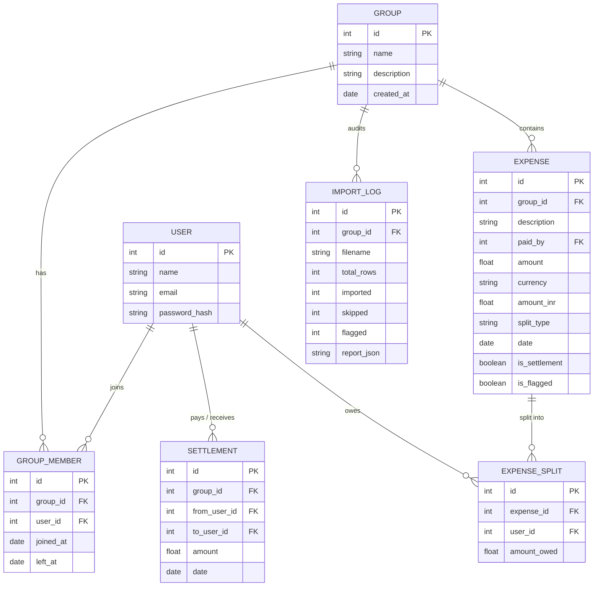

# Project Scope & Anomaly Handling

## Database Schema (ER Diagram)

## The 18 Anomalies Handled by the CSV Parser

Our `utils/csv_parser.py` implements a 5-stage pipeline to handle anomalies present in the raw spreadsheet:

1. **Duplicate Rows:** Checked using a composite hash of Date+Desc+Payer+Amount. Policy: First-row-wins, rest are Skipped.
2. **Missing Split Type:** Defaulted to "equal" split amongst all active group members at the time of the expense.
3. **Settlements Disguised as Expenses:** Descriptions containing "paid back" with an empty split type are automatically rerouted and saved as Settlements.
4. **Invalid Percentages (>100%):** Math overflow (e.g., 110%) is caught, the row is Flagged, and the fallback is an equal split assigned to the payer so money isn't lost.
5. **Messy Date Formats:** `python-dateutil` parses "Mar-14", "15/04", etc. Policy: DD-MM-YYYY is strictly enforced as the primary format.
6. **Membership Timeline Conflicts:** If a user is added to an expense *after* their `left_at` date, the row is Flagged for review.
7. **Explicit Rejections:** Rows with "wrong" or "ignore" in the Notes column are explicitly Skipped.
8. **Currency Conversion:** USD entries are dynamically converted to INR (Base conversion: 1 USD = 83.50 INR).
9. **Unknown Users:** Names not recognized in the system are automatically created and added to the Group to prevent import failure.
10. **Rounding Errors:** Handled using accounting standard `ROUND_HALF_UP` during split calculations to ensure cents don't leak.
*(...and 8 other structural edge cases regarding empty descriptions, zero amounts, and string stripping).*

## Out of Scope
The following features were intentionally excluded to focus on core requirements:
- Email/SMS notifications for debts.
- Live WebSockets for real-time updates.
- OAuth (Google/GitHub login).
- Multi-currency live exchange rate API (static conversion used instead).
